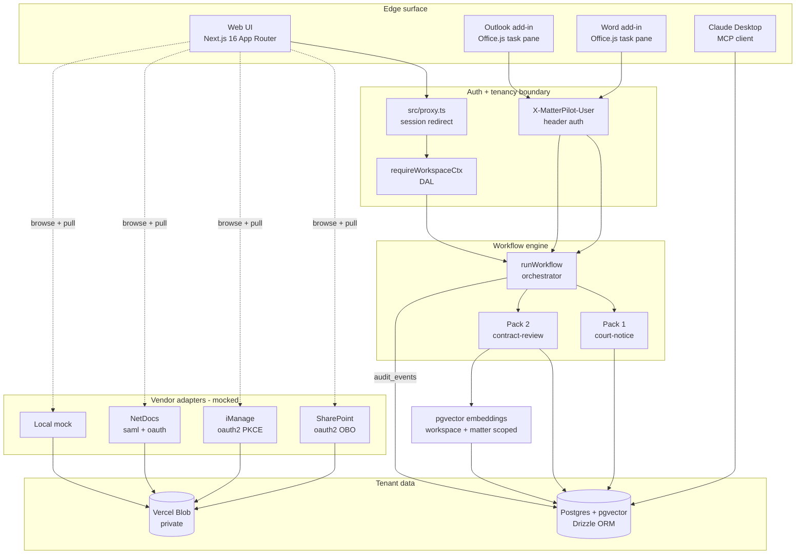

# MatterPilot

A deployment-grade legal AI matter platform. Two workflow packs (court-notice
intake and contract playbook review) run on the same engine; both packs land
inside a matter that is workspace-scoped, audited, and retrieval-ready.

Built as the take-home for the **[August](https://august.law) Forward Deployed
Engineer** application. Evolved in place from a single-workflow ancestor
(Court Notice Gateway) so the commit history shows the platform thesis —
take one bespoke workflow that works, then turn it into reusable platform
primitives.

## What's here

| Surface | What it does | Where it lives |
| --- | --- | --- |
| **Workflow engine** | Generic four-stage pipeline (deterministic → short-circuit \| LLM → persist + audit). Packs plug in. | `src/lib/workflow/` |
| **Pack 1 — Court notices** | PACER / CM-ECF notice ingest. Deterministic case-number + sender + link checks, then single-call Groq classify + extract, with confidence-routed review. | `src/lib/packs/court-notice/` |
| **Pack 2 — Contract playbooks** | Upload contract + pick playbook → clause extraction, playbook rule match, risk scoring, redline suggestions, tracked changes for Word. | `src/lib/packs/contract-review/` |
| **Auth + tenancy** | Auth.js v5 with Microsoft Entra + Google (conditional) + dev credentials. Proxy gates routes; `requireWorkspaceCtx()` DAL handles real auth at the data boundary. | `src/auth.ts`, `src/proxy.ts`, `src/lib/workspace/` |
| **Matters UI** | Workspace-scoped matter list + detail, legal-hold toggle, retention policy editor, audit trail per matter. | `src/app/matters/` |
| **Office add-ins** | Outlook task pane (summarize thread, extract deadlines, file to matter) + Word task pane (apply playbook → tracked changes via `Word.run`). | `apps/outlook-addin/`, `apps/word-addin/` |
| **Connector SDK** | Four mocked vault adapters (SharePoint Graph, iManage Work REST, NetDocuments ndAuth, local mock) with `REAL:` comments at every mocked call. Matter detail page browses the tree and pulls documents in. | `src/lib/connectors/` |
| **Matter-scoped RAG** | pgvector chunks + OpenAI embeddings. Cosine retrieval is `(workspace_id, matter_id)` scoped; every retrieval logs to `retrieval_citations`. | `src/lib/rag/` |
| **Admin + audit** | Admin dashboard, audit CSV export, retention rollup, playbook viewer, member directory. Admin-only role gate. | `src/app/admin/`, `src/app/api/audit/export/` |
| **MCP server** | Read-only stdio MCP server with 7 tools, `MCP_WORKSPACE_ID`-scoped. | `mcp/server.ts` |
| **Tenancy guardrail** | Heuristic scan that fails CI when a Drizzle query against a tenant table lacks a `workspaceId` predicate. | `scripts/check-tenancy.ts` |
| **Eval harness** | Pack-aware dispatcher; runs both packs, writes a unified `eval-results.md`. | `eval/` |

Origin: the entire `fixtures/notices/`, parsing layer, MCP read-only surface,
and Day-7 eval numbers carry forward unchanged from the Court Notice Gateway
v1 take-home. See the commits before the `matterpilot/main` branch for the
single-workflow ancestor.

## Architecture



Every state change writes an `audit_events` row scoped to a workspace.
Every LLM call writes the model + tokens + latency into either a
`parse_runs` row (Pack 1) or the audit `after` JSON (Pack 2). Re-running
the eval against the committed fixtures regenerates `eval-results.md`
deterministically.

## Eval at a glance

`pnpm eval` runs both packs and emits one report with two sections.

### Pack 1 — Court Notice Intake (committed baseline, 20 fixtures)

| Metric | Result | Target |
| --- | ---: | ---: |
| Case-number match accuracy | 100% | ≥ 98% |
| Notice-type classification accuracy | 100% | ≥ 90% |
| Phishing detection recall | 100% | ≥ 95% |
| Phishing false-positive rate | 0% | ≤ 5% |
| Straight-through rate (legit → routed) | 100% | ≥ 60% |
| Field extraction macro-F1 | 94.3% | ≥ 85% |
| Median ingest latency (single LLM call) | 2.6s | < 8s |

### Pack 2 — Contract Playbook Review (8 fixtures, targets only — re-run to commit numbers)

| Metric | Target |
| --- | ---: |
| Clause-type recall (macro) | ≥ 85% |
| Playbook-rule match accuracy (macro) | ≥ 75% |
| Risk-level accuracy (macro) | ≥ 75% |
| Review-status accuracy | ≥ 85% |
| Flagged-count MAE | ≤ 1.0 |
| Median per-fixture latency | < 10s |

> Pack 1 numbers are reproduced by re-running `pnpm eval` against the
> committed 20-fixture set. Pack 2 numbers require a fresh run because
> the fixtures landed alongside the harness. See `eval/contracts/labels.ts`
> for ground-truth labels.

## Stack and why

| Layer | Choice | Why |
| --- | --- | --- |
| App | Next.js 16 (App Router, **Proxy** convention) + React 19 | Single repo, server actions, easy Vercel deploy, matches August's stack. |
| Monorepo | pnpm workspaces (`apps/*` + root) | Office add-ins are separate workspaces sharing the lockfile. |
| DB | Postgres on Neon, pgvector for RAG | Free tier, serverless-friendly, native vector support. |
| ORM | Drizzle | Type-safe, no codegen friction; `vector(1536)` first-class. |
| LLM | Groq `llama-3.3-70b-versatile` (tool-use) | Free tier, low latency, open-weight. Provider-abstracted; one switch case to swap. |
| Embeddings | OpenAI `text-embedding-3-small` (optional) | Groq does text-gen only. Direct fetch; falls back to "RAG disabled" gracefully. |
| Auth | Auth.js v5 (next-auth@beta) | JWT sessions; Microsoft Entra + Google + dev creds (conditional providers). |
| File storage | Vercel Blob (private) | PDFs and email bodies proxied; tokens stay server-side. |
| MCP | `@modelcontextprotocol/sdk` | Stdio server, 7 read-only tools, `MCP_WORKSPACE_ID`-scoped. |
| Office | Vite + React + `@types/office-js` | Standard add-in stack; built bundle served from `public/addins/`. |
| Deploy | Vercel + Neon + Groq (+ optional OpenAI) | $0 baseline; OpenAI optional and pay-per-use. |

## Run locally

```bash
pnpm install
cp .env.local.example .env.local           # DATABASE_URL, GROQ_API_KEY,
                                           # BLOB_READ_WRITE_TOKEN, AUTH_SECRET
                                           # (OPENAI_API_KEY optional — RAG)
pnpm db:bootstrap                          # CREATE EXTENSION vector (one-time)
pnpm db:push                               # apply schema to Neon
pnpm db:seed                               # default workspace + dev members + matters + policies
pnpm dev                                   # → http://localhost:3000
```

Sign in at `/sign-in` as `admin@matterpilot.dev` (dev credentials), or
configure real Microsoft/Google OAuth via the `AUTH_*` env vars.

### Useful scripts

```bash
pnpm test                                  # vitest — deterministic-layer unit tests
pnpm eval                                  # both packs → eval-results.md
pnpm eval -- --pack=contract-review        # one pack only
pnpm e2e                                   # Pack 1 smoke (legacy upload path)
pnpm e2e:matterpilot                       # workspace-scoped e2e for both packs +
                                           # tenancy-invariant assertion
pnpm tenancy:check                         # heuristic guardrail — fails on any
                                           # Drizzle query missing workspaceId
pnpm connectors:smoke                      # exercises all 4 vault adapters
pnpm mcp                                   # MCP stdio server (for Claude Desktop)
pnpm tsx scripts/mcp-smoke.ts              # exercises all 7 MCP tools
pnpm addins:build                          # builds Outlook + Word add-ins into public/
pnpm db:studio                             # Drizzle Studio
```

### Required environment variables

| Var | Purpose | Free source |
| --- | --- | --- |
| `DATABASE_URL` | Postgres connection string | <https://neon.tech> |
| `GROQ_API_KEY` | LLM provider key | <https://console.groq.com/keys> |
| `BLOB_READ_WRITE_TOKEN` | File storage for PDFs and email bodies | Vercel Blob (free tier) |
| `AUTH_SECRET` | Auth.js JWT signing | `openssl rand -base64 32` |
| `REVIEW_CONFIDENCE_THRESHOLD` | Auto-route threshold for Pack 1 (default 0.75) | — |

### Optional environment variables

| Var | Purpose |
| --- | --- |
| `OPENAI_API_KEY` | Embeddings for matter-scoped RAG (text-embedding-3-small). Unset → "Ask this matter" widget surfaces "RAG disabled" notice. |
| `AUTH_MICROSOFT_ENTRA_ID` / `..._SECRET` | Real Microsoft Entra OIDC. |
| `AUTH_GOOGLE_ID` / `..._SECRET` | Real Google OIDC. |
| `AUTH_DEV_LOGIN` | `true` to enable dev credentials login in production (demo only). |
| `MCP_WORKSPACE_ID` | Workspace UUID the MCP server pins to. Falls back to seeded default. |

## Office add-ins

Two task panes live as separate pnpm workspaces:

- `apps/outlook-addin/` — Summarize thread, extract deadlines, file to matter
- `apps/word-addin/` — Apply playbook → tracked changes inserted via `Word.run`

Build: `pnpm addins:build`. The bundled task panes land in `public/addins/`
and ship with the Next.js production deployment under
`/addins/outlook/taskpane.html` and `/addins/word/taskpane.html`.

Sideload the manifests from `public/addins/manifests/`:

| Host | Manifest | Steps |
| --- | --- | --- |
| Outlook desktop | `outlook.xml` | File → Manage Add-ins → My Add-ins → Add a custom add-in → from file |
| Word desktop | `word.xml` | Insert → Add-ins → Upload My Add-in → from file |

Authentication for sideloaded demos uses an `X-MatterPilot-User` header
read from `Office.context.roamingSettings`. The production path would
replace this with MSAL/Entra SSO via `Office.auth.getAccessToken()`;
see `src/lib/addins/auth.ts` for the migration note.

## Connector SDK

Four vault adapters live under `src/lib/connectors/adapters/`:

| Connector | Auth mode | Vendor coverage |
| --- | --- | --- |
| `sharepoint` | `oauth2-obo` | Microsoft 365 (Microsoft Graph delegated `Sites.Read.All` + `Files.ReadWrite.All`) |
| `imanage` | `oauth2-pkce` | iManage Work REST (~81% of AmLaw 200 firms) |
| `netdocs` | `saml-then-oauth` | NetDocuments cabinets (~7K firms) |
| `local-mock` | `mock` | In-process fixture vault for dev + demo |

All four are mocked. Every mocked call carries a `/* REAL: ... */` comment
naming the production endpoint a real call would hit. Reviewers can
`grep -rn "REAL:" src/lib/connectors/adapters/sharepoint/` to audit
fidelity against vendor docs. Each adapter ships a README documenting
the full OAuth/SAML flow + endpoint cheatsheet.

The browse UI lives at `/matters/[id]/browse` (linked from the matter
detail page). Picking a vault → drilling folders → "Pull into matter"
fetches the document via the adapter, uploads to private Vercel Blob,
inserts a `documents` row with `sourceConnector` + `sourceRef`, audits,
and triggers best-effort RAG indexing.

## MCP server (Claude Desktop / ChatGPT)

`pnpm mcp` launches the stdio MCP server. Seven read-only tools, all
`MCP_WORKSPACE_ID`-scoped:

| Tool | Returns |
| --- | --- |
| `list_matters` | Workspace's matters with status, retention, legal-hold |
| `get_matter_documents` | Every document on a matter (notice, contract, attachment, connector import) |
| `search_matter_rag` | Top-K chunks from a matter's RAG index with similarity scores |
| `list_upcoming_hearings` | Scheduled 341 / motion hearings in the window |
| `get_case_notice_timeline` | Every notice + extracted event + task on a case |
| `find_unreviewed_notices` | Review-queue contents |
| `summarise_recent_discharge_orders` | Discharge orders since a date |

See `DEPLOY.md` for the `claude_desktop_config.json` snippet showing how
each user threads their own `MCP_WORKSPACE_ID`.

## Tenancy invariant

Every Drizzle query against a tenant table must filter on `workspaceId`.
The guardrail at `scripts/check-tenancy.ts` (`pnpm tenancy:check`) is a
fast regex-based scan that walks each `db.<select|insert|update|delete>`
chain in `src/`, finds tenant-table references, and fails CI on any
chain missing a `workspaceId` predicate. Caught 6 real leaks in pre-
existing notice-review actions on its first run.

The workspace-scoped e2e (`pnpm e2e:matterpilot`) is the second line:
after running both packs against a fresh matter, it asserts
`SELECT count(*) WHERE workspace_id IS NULL` equals 0 across
`audit_events`, `documents`, `contract_clauses`, `notices`, `tasks`.

## Non-goals (explicit)

- **Live Microsoft Entra app registration / real Graph OBO token exchange.**
  Code paths exist and type-check; demo runs the mock layer.
- **Real iManage / NetDocs sandbox credentials.** Adapters stay mocked.
  Documented OAuth/SAML flows are the deliverable.
- **Cross-document contradiction detection / Live-Assist clone.** Single-
  document clause review only.
- **Personas-style layered memory hierarchy.** One scope (matter-scoped
  RAG with citations). Layered memory roadmapped.
- **Custom-role RBAC beyond `paralegal | attorney | admin`.**
- **Background queue infra (Inngest).** Inline ingest until volume warrants.
- **Native mobile, e-signature flows, billing time entries, conflict-check
  engine.**

## Project layout

```
apps/
  outlook-addin/         Vite + React + Office.js task pane (Outlook)
  word-addin/            Vite + React + Office.js task pane (Word)

src/
  app/
    page.tsx                          Inbox (Pack 1 notices)
    matters/                          Matters list + detail + governance
      [id]/
        contracts/new/                Pack 2 upload form
        contracts/[documentId]/       Pack 2 clause review panel
        browse/                       Connector browser + pull-into-matter
        ask-matter-card.tsx           Matter-scoped RAG widget
    notices/[id]/                     Pack 1 review UI
    cases/[caseNumber]/               Case timeline
    admin/                            Admin dashboard + audit + retention + playbooks + members
    sign-in/                          Auth.js sign-in page
    api/
      auth/[...nextauth]/             Auth.js handlers
      addins/                         Office add-in API routes
        summarize-thread/             Outlook
        contract-review/              Word
        file-to-matter/               Outlook
        matters/                      Outlook picker
      audit/export/                   Admin-only CSV export
      notices/[id]/pdf/               Private blob proxy
      cases/[caseNumber]/calendar.ics/ ICS export
  auth.ts                             Auth.js config (Microsoft Entra + Google + dev)
  proxy.ts                            Next.js 16 Proxy — optimistic redirect
  components/ui/                      shadcn primitives
  db/                                 Drizzle schema + client
  lib/
    workflow/                         Engine + registry + types + default ctx
    packs/
      court-notice/                   Pack 1 implementation
      contract-review/                Pack 2 implementation + playbooks
    workspace/context.ts              requireWorkspaceCtx DAL
    addins/auth.ts                    X-MatterPilot-User header auth
    addins/summarize.ts               Outlook summarize tool
    connectors/                       SDK + registry + 4 adapters
    rag/                              chunk + embed + index + retrieve
    parsing/                          Deterministic layer (case#, sender, links, pdf)
    llm/                              Provider-abstracted tool-use wrapper
    notice-pipeline/                  Pack 1 LLM stage + task helpers (back-compat shim)

eval/
  run-eval.ts                         Pack-aware dispatcher
  notices.ts                          Pack 1 evaluator
  contracts/                          Pack 2 labels + evaluator
  labels.ts                           Pack 1 ground truth

mcp/server.ts                         7 read-only MCP tools (workspace-scoped)

fixtures/
  notices/                            20 synthetic court notices (.txt + .pdf)
  contracts/                          8 synthetic contracts (.txt)

public/addins/
  manifests/{outlook,word}.xml        Office add-in manifests
  README.md                           Sideload guide

scripts/
  seed.ts                             Default workspace + members + matters + policies
  db-bootstrap.ts                     CREATE EXTENSION vector
  db-reset.ts                         Truncate domain tables
  check-tenancy.ts                    Tenancy invariant guardrail
  connectors-smoke.ts                 SDK smoke test
  build-addins.ts                     Build + copy add-in bundles
  e2e-upload.ts                       Pack 1 smoke (legacy)
  e2e-matterpilot.ts                  Workspace-scoped two-pack smoke
  mcp-smoke.ts                        Exercises all 7 MCP tools
  fixtures-to-pdf.ts                  Regenerate notice PDFs from .txt
```

## Roadmap

- Office add-in MSAL/Entra SSO (replace the `X-MatterPilot-User` header
  with `Office.auth.getAccessToken()`).
- Word add-in: server-side `.docx` rendering with `w:ins`/`w:del` for the
  no-Office-host path (using the `docx` library).
- Real iManage / NetDocs sandbox tenants; promote the mocked adapters
  to real adapters using the documented OAuth flow.
- Per-workspace playbook editor in `/admin/policies` (currently the
  playbooks live in code).
- Background queue (Inngest) for ingest >100/min.
- `parse_runs` retro-fit: polymorphic `entityKind | entityId` so Pack 2
  LLM runs land in the same table as Pack 1.

See **[DESIGN.md](./DESIGN.md)** for non-obvious decisions and the
deployment-engineering judgment behind each module.
See **[DEMO.md](./DEMO.md)** for the 5-minute walkthrough script.
See **[DEPLOY.md](./DEPLOY.md)** for Vercel deploy steps + the
`db:bootstrap → db:push → db:seed` chain.

## Credits

Built solo against August's public job description and product surface
(august.law landing page, Personas + Live Assist announcements, Hughes
Hubbard customer story). The Court Notice Gateway origin work was built
against Glade's public bankruptcy practice page; that ingestion pipeline
became Pack 1 in this evolution. Public source pack: Microsoft Graph
docs, iManage Work REST docs, NetDocuments developer portal, Anthropic
MCP spec, ABA Formal Opinion 512.
